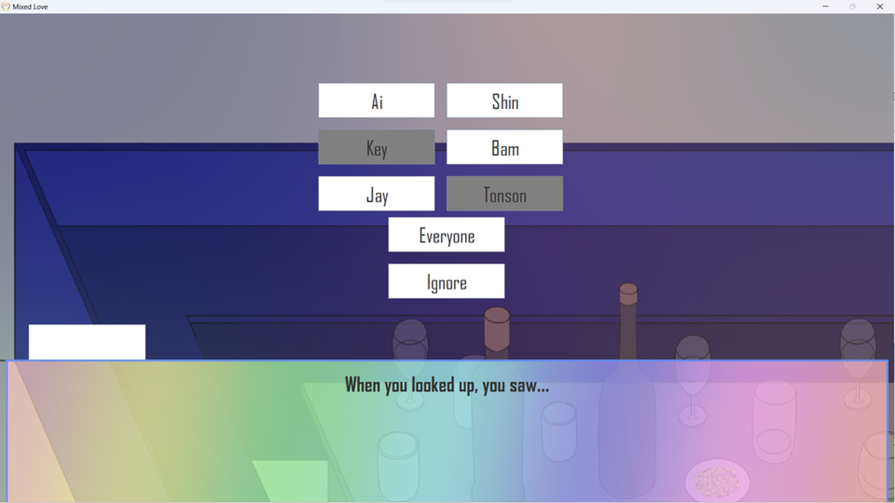

# Hi, I'm Chanakanphat Pluemjitt 👋
## About me:
I'm a Computer Science undergrauate at Chiang Mai University, Full-Stack Developer.

# PROJECT 
## Mixed Love
<li> Group project of course Introduction to Object-oriented Programming </li>
<li> Visual Novel Game that developed in Java, applying core principles of OOP concept. </li>
<!--  -->

  
  
  
   
  

## BookItBuddies
<li> Group project of course Modern Application Development </li>
<li> Web Application that can manage events, applying JS, HTML, CSS, Python, flask to developed </li>

## Sous cook
<li> Group project of course Software Engineering, and Database Systems </li>
<li> Web Application that can serch for food menu, applying React.js, CSS, Node.js, PostgreSQL to developed </li>

## Exchange of Things
<li> Personal project of course System Analysis and Design </li>
<li> Web Application that can exchange item with others, applying React.js, CSS, Node.js, PostgreSQL to developed </li>

